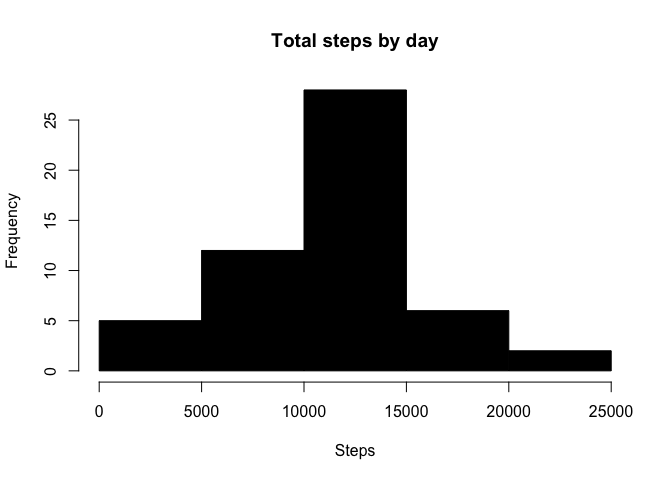
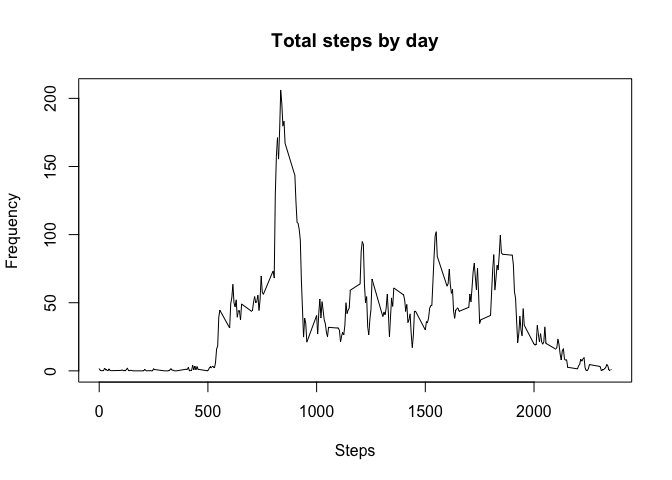
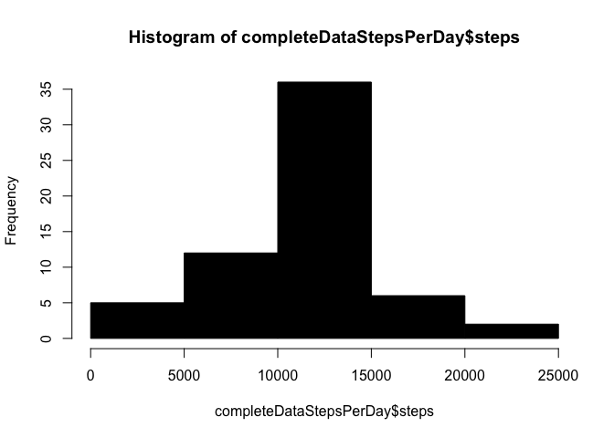

# Reproducible Research: Peer Assessment 1


```
## 
## Attaching package: 'dplyr'
## 
## The following objects are masked from 'package:stats':
## 
##     filter, lag
## 
## The following objects are masked from 'package:base':
## 
##     intersect, setdiff, setequal, union
```

## Loading and preprocessing the data

```r
data <- read.csv("activity.csv")
data$date <- as.Date(data$date)
completeFactor <- complete.cases(data)
head(data)
```

```
##   steps       date interval
## 1    NA 2012-10-01        0
## 2    NA 2012-10-01        5
## 3    NA 2012-10-01       10
## 4    NA 2012-10-01       15
## 5    NA 2012-10-01       20
## 6    NA 2012-10-01       25
```


## What is mean total number of steps taken per day?

### Calculate the total number of steps taken per day


```r
stepsPerDay <- data[completeFactor,] %>%
  group_by(date) %>%
  summarise(steps=sum(steps, na.rm=T))
head(stepsPerDay)
```

```
## Source: local data frame [6 x 2]
## 
##         date steps
## 1 2012-10-02   126
## 2 2012-10-03 11352
## 3 2012-10-04 12116
## 4 2012-10-05 13294
## 5 2012-10-06 15420
## 6 2012-10-07 11015
```

### Make a histogram of the total number of steps taken each day

```r
hist(stepsPerDay$steps, col=1, main = "Total steps by day", xlab="Steps", ylab="Frequency")
```

 

### Calculate and report the mean and median of the total number of steps taken per day

```r
mean1 <- mean(stepsPerDay$steps)
median1 <- median(stepsPerDay$steps)
print(paste0("Mean is: ", mean1))
```

```
## [1] "Mean is: 10766.1886792453"
```

```r
print(paste0("Median is: ", median1))
```

```
## [1] "Median is: 10765"
```


## What is the average daily activity pattern?

### Make a time series plot (i.e. type = "l") of the 5-minute interval (x-axis) and the average number of steps taken, averaged across all days (y-axis)

```r
stepsPerDayInterval <- data %>%
  select(interval, steps) %>%
  group_by(interval) %>%
  summarise(meansteps=mean(steps, na.rm=T))
stepsPerDayInterval
```

```
## Source: local data frame [288 x 2]
## 
##    interval meansteps
## 1         0 1.7169811
## 2         5 0.3396226
## 3        10 0.1320755
## 4        15 0.1509434
## 5        20 0.0754717
## 6        25 2.0943396
## 7        30 0.5283019
## 8        35 0.8679245
## 9        40 0.0000000
## 10       45 1.4716981
## ..      ...       ...
```


```r
plot(stepsPerDayInterval$interval, stepsPerDayInterval$meansteps, type="l", , main = "Total steps by day", xlab="Steps", ylab="Frequency")
```

 

### Which 5-minute interval, on average across all the days in the dataset, contains the maximum number of steps?


```r
maxDailyAverageSteps <- stepsPerDayInterval[which.max(stepsPerDayInterval$meansteps),]
print(maxDailyAverageSteps)
```

```
## Source: local data frame [1 x 2]
## 
##   interval meansteps
## 1      835  206.1698
```


## Imputing missing values

### Calculate and report the total number of missing values in the dataset (i.e. the total number of rows with NAs)


```r
incompleteRows = completeFactor[completeFactor==FALSE]
length(incompleteRows)
```

```
## [1] 2304
```

### Devise a strategy for filling in all of the missing values in the dataset. The strategy does not need to be sophisticated. For example, you could use the mean/median for that day, or the mean for that 5-minute interval, etc.

The strategy is to fill the missing steps with the mean steps for that same interval.

### Create a new dataset that is equal to the original dataset but with the missing data filled in.

```r
completeData <- data
for (i in 1:nrow(completeData)) {
  if (is.na(completeData$steps[i])) {
    completeData$steps[i] <- stepsPerDayInterval[which(completeData$interval[i] == stepsPerDayInterval$interval), ]$meansteps
  }
}
head(completeData)
```

```
##       steps       date interval
## 1 1.7169811 2012-10-01        0
## 2 0.3396226 2012-10-01        5
## 3 0.1320755 2012-10-01       10
## 4 0.1509434 2012-10-01       15
## 5 0.0754717 2012-10-01       20
## 6 2.0943396 2012-10-01       25
```

### Make a histogram of the total number of steps taken each day and Calculate and report the mean and median total number of steps taken per day. Do these values differ from the estimates from the first part of the assignment? What is the impact of imputing missing data on the estimates of the total daily number of steps?


```r
completeDataStepsPerDay <- completeData %>%
  group_by(date) %>%
  summarise(steps=sum(steps, na.rm=T))
hist(completeDataStepsPerDay$steps, col=1)
```

 

```r
mean(completeDataStepsPerDay$steps)
```

```
## [1] 10766.19
```

```r
median(completeDataStepsPerDay$steps)
```

```
## [1] 10766.19
```

```r
mean2 <- mean(completeDataStepsPerDay$steps)
median2 <- median(completeDataStepsPerDay$steps)
print(paste0("Mean is: ", mean2))
```

```
## [1] "Mean is: 10766.1886792453"
```

```r
print(paste0("Median is: ", median2))
```

```
## [1] "Median is: 10766.1886792453"
```

```r
print(paste0("Difference in means is: ", mean2-mean1))
```

```
## [1] "Difference in means is: 0"
```

```r
print(paste0("Difference in medians is: ", median2-median1))
```

```
## [1] "Difference in medians is: 1.1886792452824"
```

Imputing missing data affects only the median, it moves it a litle bit to the same position as the mean.


## Are there differences in activity patterns between weekdays and weekends?

### Create a new factor variable in the dataset with two levels – “weekday” and “weekend” indicating whether a given date is a weekday or weekend day.


```r
completeData$days <- factor(weekdays(completeData$date))
levels(completeData$days) <- list(weekday = c("Monday", "Tuesday", "Wednesday", "Thursday", "Friday"), weekend = c("Saturday", "Sunday"))
summary(completeData$days)
```

```
## weekday weekend 
##   12960    4608
```

### Make a panel plot containing a time series plot (i.e. type = "l") of the 5-minute interval (x-axis) and the average number of steps taken, averaged across all weekday days or weekend days (y-axis).


```r
stepsByDay <- aggregate(steps ~ interval + days, data = completeData, mean)
names(stepsByDay) <- c("interval", "days", "steps")
xyplot(steps ~ interval | days, stepsByDay, type = "l", layout = c(1, 2), 
    xlab = "Interval", ylab = "Number of steps")
```

 
